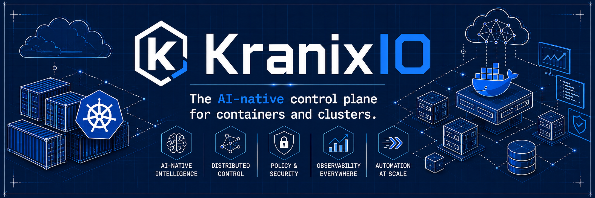

<div align="center">

<br/>

```
██╗  ██╗██████╗  █████╗ ███╗   ██╗██╗██╗  ██╗
██║ ██╔╝██╔══██╗██╔══██╗████╗  ██║██║╚██╗██╔╝
█████╔╝ ██████╔╝███████║██╔██╗ ██║██║ ╚███╔╝
██╔═██╗ ██╔══██╗██╔══██║██║╚██╗██║██║ ██╔██╗
██║  ██╗██║  ██║██║  ██║██║ ╚████║██║██╔╝ ██╗
╚═╝  ╚═╝╚═╝  ╚═╝╚═╝  ╚═╝╚═╝  ╚═══╝╚═╝╚═╝  ╚═╝
```

### AI-native control plane for Docker & Kubernetes

**Deploy. Orchestrate. Operate — for humans and AI agents alike.**

<br/>

[](./LICENSE)
[](#)
[](#)
[](#)

[Documentation](#) · [Getting Started](#) · [Roadmap](#) · [Discussions](#)

<br/>

</div>

<div align="center">
  
</div>

---

## What is Kranix?

Kranix is an open-source infrastructure platform that makes Kubernetes and Docker **operable by both developers and AI agents**. It provides a modular, composable control plane — from a local dev container all the way to a production multi-node cluster — with a consistent interface across every layer.

Most Kubernetes tooling is YAML-heavy, fragmented, and built for a world before AI. Kranix is built for the world we're in now: one where AI agents can safely deploy, inspect, debug, and heal infrastructure alongside the humans who build it.

```
Developer / AI Agent
        │
   CLI or MCP
        │
   Kranix API
        │
  Kranix Core
   (reconciler)
        │
   ┌────┼────┐
   ▼    ▼    ▼
Docker  K8s  Remote Nodes
```

---

## Core ideas

**AI-operable by design.** Kranix exposes a full [MCP](https://modelcontextprotocol.io) server (`kranix-mcp`), so AI agents like Claude or GPT can deploy workloads, stream logs, analyze failures, and generate manifests — all within audited, safe boundaries. No prompt hacking required; infra operations are first-class MCP tools.

**One control plane, any backend.** The same `kranix deploy` command and the same API work whether you're running a local Docker container, a `kind` cluster, or a remote production Kubernetes node. The runtime abstraction layer handles the difference.

**GitOps-native.** Commit a `KraneApp` manifest, the operator reconciles it. No manual `kubectl apply` chains. Git is the source of truth; Kranix makes it so.

**AI-powered debugging.** `kranix analyze <workload>` returns a crash reason, probable fix, resource bottleneck summary, and — where possible — a generated patch. This is not a wrapper around `kubectl describe`; it's a reasoning layer on top of the full runtime state.

---

## Ecosystem

| Repository | Layer | What it does |
|---|---|---|
| [`kranix-core`](./kranix-core) | Engine | Reconciliation loops, scheduling, state management, policy enforcement |
| [`kranix-api`](./kranix-api) | Interface | Versioned REST & gRPC API — the single front door for all clients |
| [`kranix-mcp`](./kranix-mcp) | AI layer | MCP server exposing Kranix to Claude, GPT, and any MCP-compatible agent |
| [`kranix-cli`](./kranix-cli) | Terminal | `kranix deploy`, `kranix logs`, `kranix analyze` — the human-facing UX |
| [`kranix-runtime`](./kranix-runtime) | Drivers | Docker, Kubernetes, Podman, and remote node backends |
| [`kranix-operator`](./kranix-operator) | GitOps | Kubernetes operator watching `KranixApp` CRDs for GitOps-native reconciliation |
| [`kranix-charts`](./kranix-charts) | Deploy | Helm charts — install the full platform with a single `helm install` |
| [`kranix-packages`](./kranix-packages) | SDK | Shared types, errors, logging, and public Go/TypeScript SDK |
| [`kranix-examples`](./kranix-examples) | Guides | End-to-end examples, demo projects, and integration walkthroughs |

Each repo has its own README with architecture context, configuration reference, and getting-started guide.

---

## MCP tools (AI agent interface)

When an AI agent connects to `kranix-mcp`, it gets access to:

| Tool | Description |
|---|---|
| `deploy_workload` | Deploy an app from an image or manifest |
| `list_workloads` | List workloads across namespaces |
| `stream_logs` | Stream live logs from any pod |
| `restart_workload` | Restart a workload |
| `analyze_workload` | AI-powered failure analysis with suggested fix |
| `generate_manifest` | Generate a K8s manifest from a plain-text description |
| `get_cluster_health` | Cluster-wide health summary |
| `create_namespace` | Create and configure a namespace |

Agents can observe and act — but cannot modify RBAC, access secrets, or perform bulk deletes. Every action is logged with agent identity and outcome.

---

## Planned features

- [x] Repo and ecosystem structure
- [ ] `kranix-core` — reconciler and event bus
- [ ] `kranix-api` — REST/gRPC API server
- [ ] `kranix-runtime` — Docker and Kubernetes drivers
- [ ] `kranix-mcp` — MCP server with full tool set
- [ ] `kranix-cli` — terminal UX with all commands
- [ ] `kranix-operator` — CRD-based GitOps operator
- [ ] `kranix-charts` — Helm chart for full-platform install
- [ ] AI failure analysis and patch generation
- [ ] Multi-node remote orchestration
- [ ] Ephemeral environment support
- [ ] Cluster observability and drift detection
- [ ] GPU workload scheduling

---

## Principles

**Programmable.** Every operation available in the UI or CLI is available via API and via MCP. No special modes, no hidden surfaces.

**Composable.** Use only the repos you need. `kranix-runtime` works standalone. `kranix-mcp` works with any MCP client. Nothing requires the full stack.

**Observable.** All state transitions are logged and surfaced through the status API. Reconciliation is transparent, not a black box.

**Portable.** Same interface, same manifests, same CLI — whether you're on a laptop with Docker or a 50-node production cluster.

**Open.** Apache 2.0. Community decisions happen in Discussions. Roadmap is public.

---

## Getting started

Documentation and starter guides are actively being written alongside the initial repos. Watch this org or star individual repos to follow progress.

Early adopters and contributors are welcome at any stage — see [Contributing](#contributing) below.

---

## Contributing

Kranix is in early development and the best time to shape it is now.

Good areas to contribute today:

- **Core engine** — reconciler design, state store backends, event bus
- **Runtime drivers** — Docker, Podman, remote node support
- **MCP tooling** — new tools, safety policy, agent testing
- **Documentation** — guides, architecture docs, examples
- **Ideas** — open a Discussion if you have thoughts on direction

If you work on Kubernetes, container runtimes, platform engineering, AI tooling, or DevOps — we'd like to build this with you.

Start with [Discussions](https://github.com/kranix-io/.github/discussions) or open an issue in the relevant repo.

---

<div align="center">

<br/>

**KranixIO** · Apache 2.0 · Built in public

*The programmable control plane for modern infrastructure.*

<br/>

</div>
